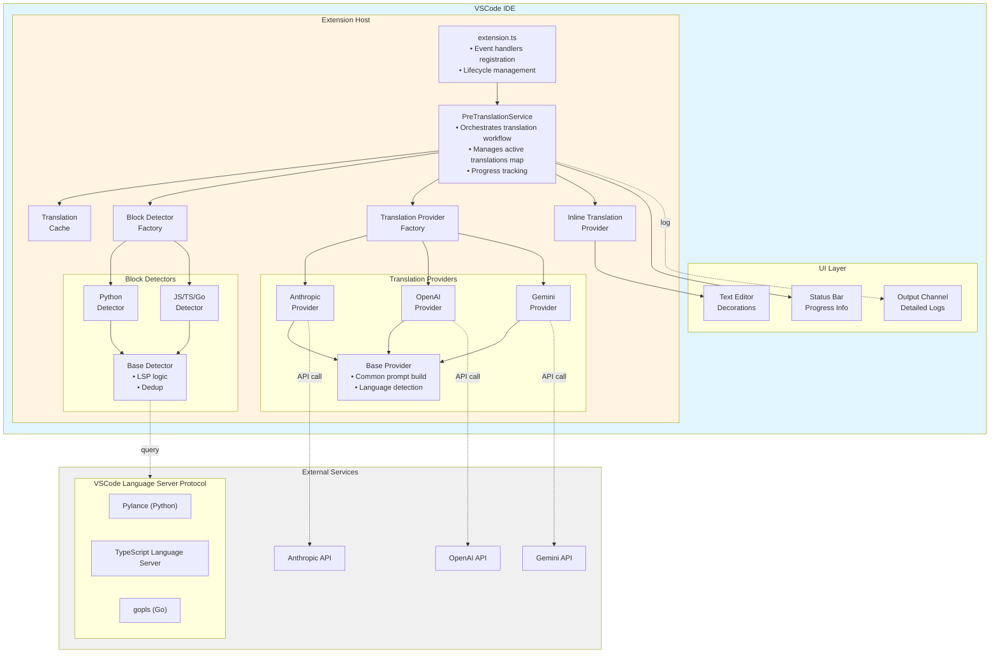
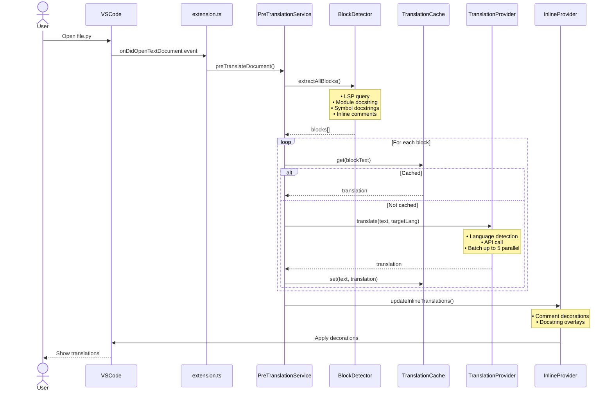
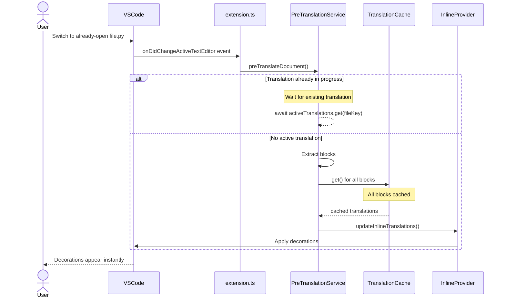
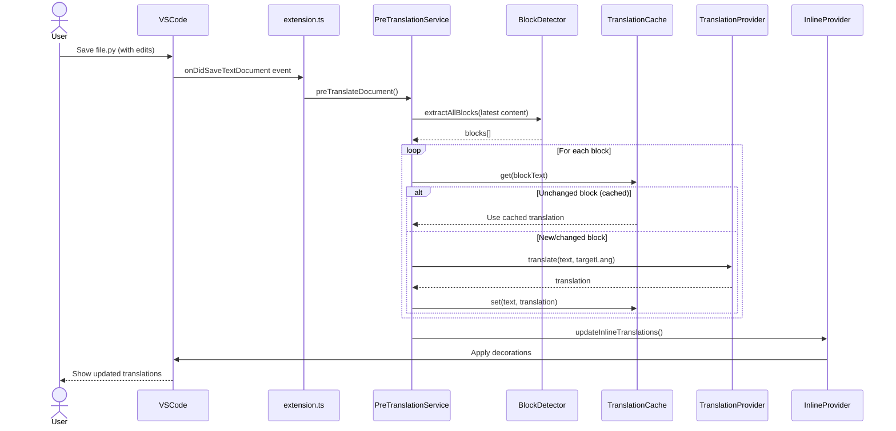
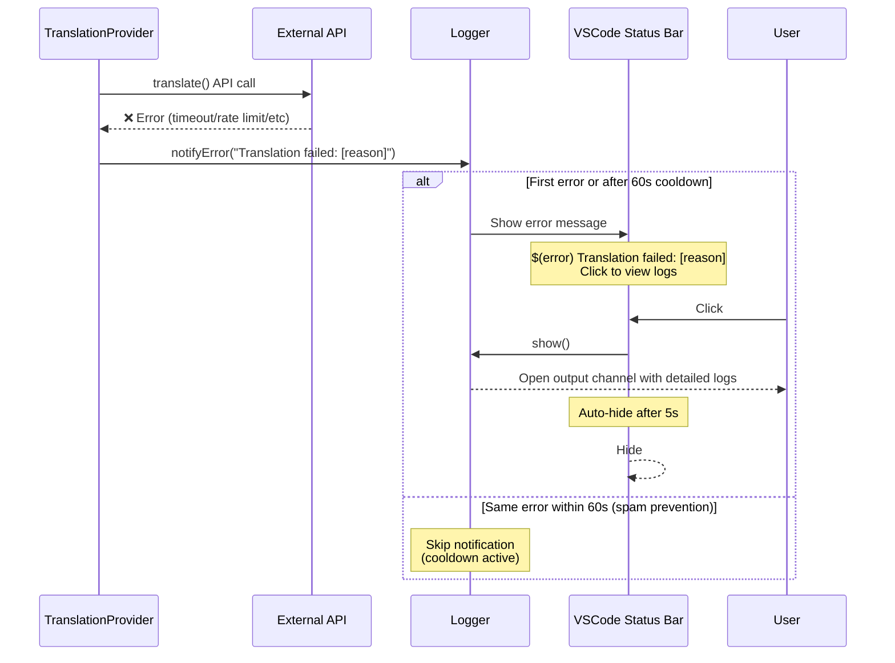

# Doc Translate アーキテクチャドキュメント

このドキュメントでは、Doc Translate VSCode拡張機能の技術アーキテクチャを説明します。

## 目次

- [システム概要](#システム概要)
- [アーキテクチャ図](#アーキテクチャ図)
- [コアコンポーネント](#コアコンポーネント)
- [データフロー](#データフロー)
- [ディレクトリ構造](#ディレクトリ構造)
- [設計原則](#設計原則)

## システム概要

Doc Translateは、コード内のdocstringとコメントを複数のLLMを使用してリアルタイムで翻訳し、VSCodeエディタ内にインライン表示するVSCode拡張機能です。

### 主要な特徴

- **マルチLLM対応**: Anthropic Claude、OpenAI、Google Gemini
- **マルチ言語対応**: Python、JavaScript、TypeScript、Go
- **自動言語検出**: 翻訳元言語を自動検出
- **キャッシュベース**: 翻訳結果を永続化し、API呼び出しを最小化
- **非侵入的**: ファイルを変更せず、見た目のみ変更

## アーキテクチャ図



## コアコンポーネント

### 1. エントリーポイント層

#### extension.ts
拡張機能のライフサイクルを管理し、イベントハンドラーを登録します。

**主要な役割:**
- `activate()`: 拡張機能の初期化
- イベントリスナー登録:
  - `onDidOpenTextDocument`: ファイルオープン
  - `onDidChangeActiveTextEditor`: タブ切り替え
  - `onDidSaveTextDocument`: ファイル保存
  - `onDidChangeTextDocument`: ファイル編集
  - `onDidChangeTextEditorSelection`: テキスト選択変更

### 2. サービス層

#### PreTranslationService
翻訳処理全体を調整するメインサービスです。

**主要な機能:**
- ブロック抽出の調整
- キャッシュチェック
- 並列翻訳の管理（最大5並列）
- 進捗表示の更新
- デコレーションの更新

**キーコンセプト:**
```typescript
// 常にキャッシュベースで動作
async preTranslateDocument(document) {
    // 重複実行防止
    if (activeTranslations.has(fileKey)) {
        await activeTranslations.get(fileKey);
        return;
    }

    // ブロック抽出
    blocks = await extractAllBlocks(document);

    // キャッシュチェック
    for (block of blocks) {
        if (cache.has(block.text)) {
            // キャッシュヒット（API呼び出しなし）
            useCache();
        } else {
            // 翻訳実行
            translate(block);
        }
    }

    // 表示更新
    updateInlineTranslations();
}
```

#### InlineTranslationProvider
翻訳テキストをエディタに表示するサービスです。

**表示方式:**
1. **コメント**: `after` decoration で行末に表示
   ```
   # Original comment→ # 翻訳されたコメント
   ```

2. **Docstring**: `opacity: 0` で原文を隠し、`before` で翻訳を表示
   ```
   元のdocstring (非表示)
   翻訳されたdocstring (表示)
   ```

**カーソル位置での原文表示:**
- docstringにカーソルがある場合、decorationを除外
- 原文が見えるようになる

#### TranslationCache
SHA-256ハッシュベースの永続化キャッシュです。

**特徴:**
- VSCode `globalState` に保存
- 拡張機能再起動後も保持
- 自動保存（`set()`時）
- 自動ロード（起動時）

### 3. 検出層

#### BlockDetectorFactory
言語に応じた適切なdetectorを提供するファクトリーです。

**サポート言語:**
- Python → `PythonBlockDetector`
- JavaScript/TypeScript → `JavaScriptBlockDetector`
- Go → `GoBlockDetector`

#### BaseBlockDetector (抽象クラス)
全detectorの共通ロジックを提供します。

**共通メソッド:**
```typescript
// LSPからシンボル取得
protected async getSymbolsFromLSP(document)

// 位置からシンボルを検索（再帰的）
protected findSymbolAtPosition(symbols, position)

// ブロック重複排除
protected deduplicateBlocks(blocks)
```

#### 言語別Detector
各言語特有の抽出ロジックを実装します。

**PythonBlockDetector:**
- `"""` / `'''` でdocstring検出
- `#` でコメント検出
- モジュールdocstringのサポート

**JavaScriptBlockDetector:**
- `/** */` でJSDoc検出
- `//` でコメント検出
- ファイルレベルJSDocのサポート

**GoBlockDetector:**
- `/* */` でgodoc検出
- `//` でコメント検出
- package docのサポート

### 4. 翻訳プロバイダー層

#### TranslationProviderFactory
設定に応じた翻訳プロバイダーを提供します。

**サポートプロバイダー:**
- `anthropic` → `AnthropicProvider`
- `openai` → `OpenAIProvider`
- `gemini` → `GeminiProvider`

#### BaseProvider (抽象クラス)
全プロバイダーの共通ロジックを提供します。

**共通メソッド:**
```typescript
// プロンプト構築
protected buildPrompt(text, targetLang)

// 翻訳必要性チェック（言語検出）
protected async checkTranslationNeeded(text, targetLang)
```

#### 言語別Provider
各LLMプロバイダー特有のAPI呼び出しロジックを実装します。

**共通フロー:**
1. APIキーチェック
2. 言語検出（翻訳不要ならスキップ）
3. プロンプト構築
4. API呼び出し（タイムアウト・リトライ付き）
5. レスポンス処理

### 5. ユーティリティ層

#### ConfigManager
集中化された設定管理を提供します。

**取得可能な設定:**
- プロバイダー選択
- APIキー（環境変数優先）
- モデル名
- タイムアウト
- リトライ設定
- ターゲット言語

#### Logger
構造化ログと通知機能を提供します。

**ログレベル:**
- `debug()`: 詳細なデバッグ情報
- `info()`: 一般的な情報
- `warn()`: 警告
- `error()`: エラー

**通知機能:**
- `notifyCriticalError()`: ダイアログ表示（APIキー未設定など）
- `notifyError()`: ステータスバー通知（タイムアウトなど）
- `notifyWarning()`: ステータスバー警告

**スパム防止:**
- 同じエラーは60秒間に1回のみ通知

#### LanguageDetector
franc ライブラリを使用した言語検出を提供します。

**機能:**
- `detectLanguage()`: テキストの言語を検出
- `isTranslationNeeded()`: 翻訳が必要かチェック

#### CommentFormatter
言語別のコメントフォーマットを提供します。

**フォーマット:**
- Python: `"""text"""`
- JavaScript/TypeScript: `/** text */`
- Go: `/* text */`

#### RetryHelper
指数バックオフによるリトライロジックを提供します。

**特徴:**
- レート制限エラーの検出
- リトライ可能エラーの判定
- 指数バックオフ
- 最大リトライ回数制限

## データフロー

### 1. ファイルオープン時



### 2. タブ切り替え時



### 3. ファイル保存時



### 4. エラー発生時



## ディレクトリ構造

```
src/
├── extension.ts                    # Entry point
├── providers/                      # Translation providers
│   ├── base/
│   │   ├── baseProvider.ts        # Common provider logic
│   │   └── translationProvider.ts # Provider interface
│   ├── anthropicProvider.ts       # Anthropic Claude
│   ├── openaiProvider.ts          # OpenAI
│   ├── geminiProvider.ts          # Google Gemini
│   └── translationProviderFactory.ts
├── detectors/                      # Block detectors
│   ├── base/
│   │   ├── baseDetector.ts        # Common detector logic
│   │   └── blockDetector.ts       # Detector interface
│   ├── pythonBlockDetector.ts     # Python
│   ├── javascriptBlockDetector.ts # JS/TS
│   ├── goBlockDetector.ts         # Go
│   └── blockDetectorFactory.ts
├── services/                       # Core services
│   ├── preTranslationService.ts   # Translation orchestration
│   ├── inlineTranslationProvider.ts # Display decorations
│   └── translationCache.ts        # Persistent cache
├── utils/                          # Utilities
│   ├── logger.ts                  # Logging & notifications
│   ├── config.ts                  # Configuration management
│   ├── constants.ts               # Shared constants
│   ├── retryHelper.ts             # Retry logic
│   ├── languageDetector.ts        # Language detection
│   └── commentFormatter.ts        # Format translations
└── test/                           # Tests
    ├── baseDetector.test.ts
    ├── languageDetector.test.ts
    ├── commentFormatter.test.ts
    ├── translationCache.test.ts
    ├── config.test.ts
    ├── blockDetector.test.ts      # Integration tests
    └── assets/                     # Test fixtures
        ├── sample.py
        ├── sample.js
        ├── sample.ts
        └── sample.go
```

## 設計原則

### 1. 関心の分離 (Separation of Concerns)

各コンポーネントは単一の責務を持ちます：
- **Detector**: ブロック抽出のみ
- **Provider**: 翻訳のみ
- **Service**: オーケストレーションのみ
- **Cache**: キャッシュ管理のみ

### 2. ファクトリーパターン

言語やプロバイダーに応じた適切な実装を提供：
```typescript
// 設定に基づいて適切なプロバイダーを取得
const provider = TranslationProviderFactory.getProvider();

// 言語に基づいて適切なdetectorを取得
const detector = BlockDetectorFactory.getDetector(languageId);
```

### 3. 継承による共通化

重複コードを基底クラスに集約：
```typescript
// 全providerの共通ロジック
abstract class BaseProvider {
    protected buildPrompt(text, targetLang) {...}
    protected checkTranslationNeeded(text, targetLang) {...}
}

// 全detectorの共通ロジック
abstract class BaseBlockDetector {
    protected getSymbolsFromLSP(document) {...}
    protected findSymbolAtPosition(symbols, position) {...}
    protected deduplicateBlocks(blocks) {...}
}
```

### 4. キャッシュファースト

常にキャッシュを優先し、API呼び出しを最小化：
```typescript
// 必ず実行されるが、キャッシュがあればAPI不要
for (block of blocks) {
    translation = cache.get(block.text) || await api.translate(block.text);
}
```

### 5. 非同期並列処理

パフォーマンス向上のため、並列処理を活用：
```typescript
// 最大5個まで並列翻訳
while (index < blocks.length) {
    batch = blocks.slice(index, index + 5);
    await Promise.all(batch.map(block => translate(block)));
}
```

### 6. エラーハンドリング

ユーザーに適切なフィードバックを提供：
- **Critical**: ダイアログ表示（APIキー未設定）
- **Error**: ステータスバー通知（タイムアウト）
- **Warning**: ステータスバー通知（軽微な問題）

スパム防止のため、同じエラーは60秒に1回のみ通知。

### 7. イベント駆動

VSCodeのイベントに反応して動作：
```typescript
// ファイル操作イベント
onDidOpenTextDocument → translate
onDidChangeActiveTextEditor → translate
onDidSaveTextDocument → translate

// UI イベント
onDidChangeTextEditorSelection → refresh decorations
```

### 8. 設定の集中管理

`ConfigManager` で全設定を一元管理：
```typescript
// 散在する vscode.workspace.getConfiguration() を排除
const provider = ConfigManager.getProvider();
const timeout = ConfigManager.getTimeout();
const apiKey = ConfigManager.getAnthropicApiKey();
```

## パフォーマンス最適化

### 1. キャッシュ戦略
- SHA-256ハッシュでテキストをキー化
- VSCode globalStateで永続化
- 拡張機能再起動後も利用可能

### 2. 並列翻訳
- 最大5並列でAPI呼び出し
- レート制限対策
- バッチ処理で効率化

### 3. 重複実行防止
- `activeTranslations` Mapで管理
- 同じファイルの同時翻訳を防止
- 既存の翻訳Promiseを再利用

### 4. LSP活用
- 正規表現よりも高精度
- VSCode標準機能を活用
- 言語サーバーに処理を委譲

### 5. 段階的表示
- 翻訳完了したブロックから順次表示
- ユーザーは待たずに結果を確認可能
- UX向上

## セキュリティ考慮事項

### 1. APIキー管理
- 環境変数優先（設定ファイルに保存しない）
- ログに出力しない
- エラーメッセージに含めない

### 2. 入力検証
- テキスト長チェック
- 不正な言語コード排除
- タイムアウト設定

### 3. エラー情報
- スタックトレースはログのみ
- ユーザーには簡潔なメッセージ
- 機密情報の漏洩防止

## 拡張性

### 新しいプログラミング言語の追加

1. `src/detectors/` に新しいdetectorを作成
2. `BaseBlockDetector` を継承
3. `BlockDetectorFactory` に登録
4. `package.json` の `supportedLanguages` に追加

### 新しいLLMプロバイダーの追加

1. `src/providers/` に新しいproviderを作成
2. `BaseProvider` を継承
3. `ITranslationProvider` を実装
4. `TranslationProviderFactory` に登録
5. `package.json` に設定項目を追加

### 新しい翻訳言語の追加

1. `src/utils/constants.ts` の `LANGUAGE_NAMES` に追加
2. `franc` ライブラリが対応していれば自動的に検出可能
3. 設定不要（自動検出）
